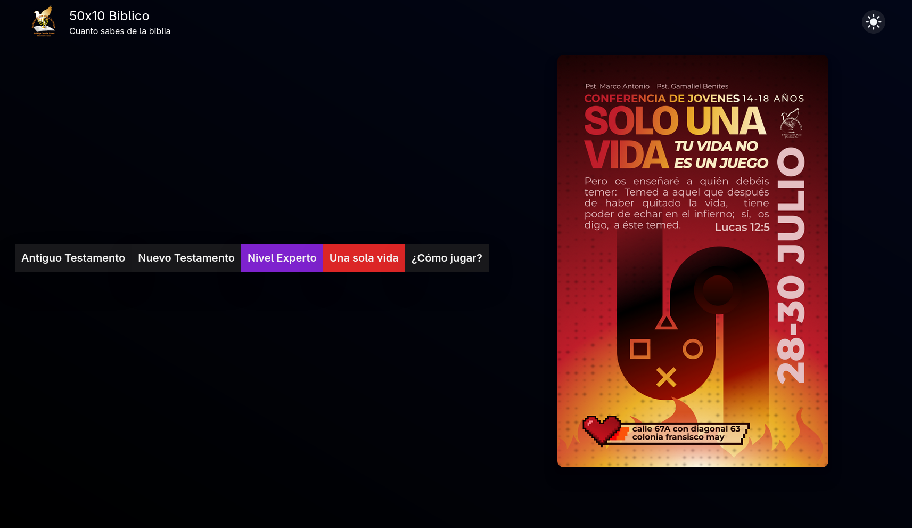
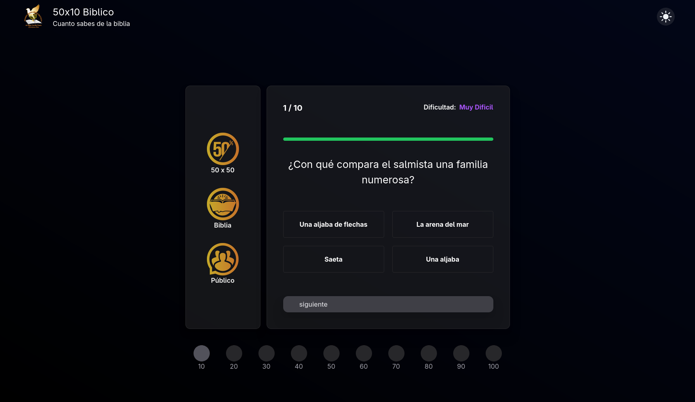
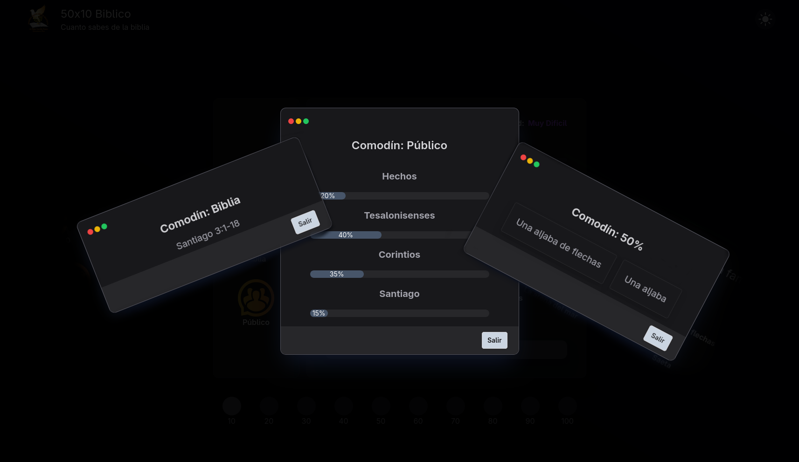
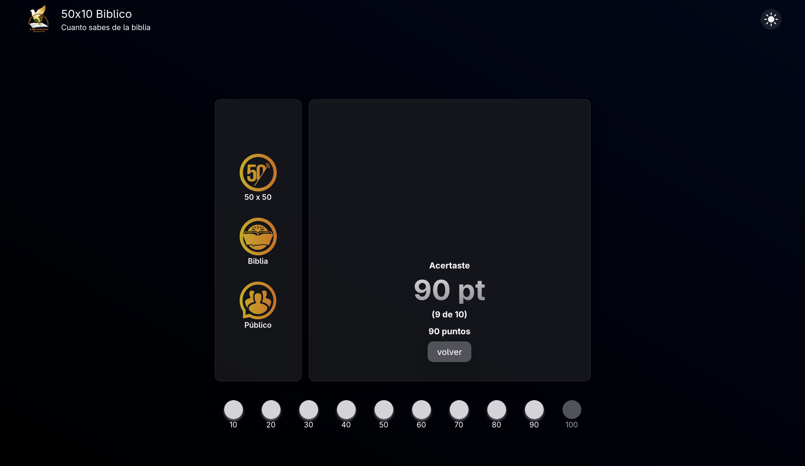

<h1 align="center">📖 ¿Cuánto Sabes de la Biblia?</h1>

<p align="center">
  
</p>

<div align="center">
  <a href="#-instalación"><kbd>📦 Instalación</kbd></a> &nbsp;|&nbsp;
  <a href="#-acerca-de"><kbd>📖 Acerca de</kbd></a> &nbsp;|&nbsp;
  <a href="#-tecnologías"><kbd>🛠️ Tecnologías</kbd></a>
</div>

---

### 📖 Acerca de

**¿Cuánto Sabes de la Biblia?** es una aplicación web de trivia bíblica basada en la versión **Reina-Valera 1960**, diseñada para poner a prueba tus conocimientos de una forma divertida e interactiva.

#### Características principales:

- ✅ Clasificación temática:
  - Antiguo Testamento
  - Nuevo Testamento
  - Nivel experto
- 🧩 Comodines disponibles:
  - 50/50
  - ¿Qué dice el público?
  - Referencia bíblica
- ⏳ Temporizador de 15 segundos por pregunta
- 🌑 Soporte para tema claro/oscuro
- ⚡ Animaciones fluidas con Framer Motion
- 📊 Barra de progreso visual por nivel
- 🎵 Efectos de sonido dinámicos

---

### 📦 Instalación

#### Clona el repositorio:

```bash
git clone --depth=1 https://github.com/Royel2000/Cuanto-sabes-de-la-Biblia.git
cd Cuanto-sabes-de-la-Biblia
```

Instala las dependencias:
```bash
npm install
```

Ejecuta el proyecto en desarrollo:

```bash
npm run dev
```
    ⚠️ Asegúrate de tener Node.js ≥ 16 instalado.

### 🛠️ Tecnologías

Este proyecto fue construido con:

- ⚛️ React
- 🌀 Tailwind CSS
- 🎬 Framer Motion
- ⚡ Vite como bundler ultrarrápido

### 📸 Capturas

| Inicio | Pregunta | Comodines | Resultados |
|:------:|:--------:|:---------:|:----------:|
|  |  |  |  |

### 🙋‍♂️ Autor

Desarrollado con ❤️ por @Royel2000

### 📜 Licencia
Este proyecto está bajo la licencia MIT
